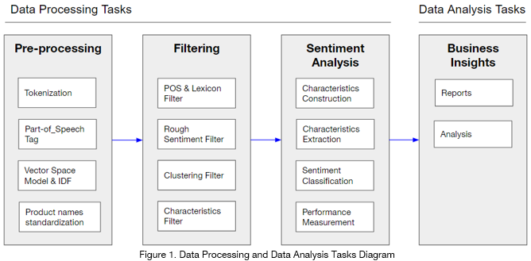

# nlp_amazon_reviews
View notebook <a href="https://github.com/irecasens/nlp_amazon_reviews/blob/master/Sentiment%20Analysis%20Notebook.ipynb"> here </a>.

## Introduction
Merchants selling products through ecommerce often received a high amount of customers reviews too large in scale for human processing. These reviews often have important business insights that can be leveraged to perform actions that can improve profits. In this project we analyze ~400,000 mobile phone reviews from Amazon.com aiming to find trends and patterns to determine which product characteristics are mentioned most by customers and with what sentiment.

Our task is performed in six steps:

(1) pre-processing to prepare the data for analysis including tokenization and part-of-speech tagging

(2) product names standardization

(3) characteristics extraction

(4) reviews filtering to remove  reviews considered as outliers, unbalanced or meaningless

(5) sentiment extraction for each product-characteristic

(6) performance analysis to determine the accuracy of the model where we evaluate characteristic extraction separately from sentiment scores

The dataset can be found in Kaggle:
- https://www.kaggle.com/PromptCloudHQ/amazon-reviews-unlocked-mobile-phones/downloads/Amazon_Unlocked_Mobile.csv

## Methodology

A flowchart of the project, including the approach, performance and final business analysis is presented below:

